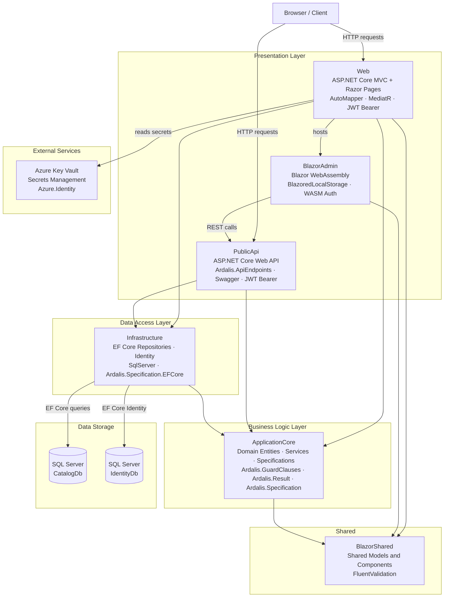

# Architecture Diagram

This diagram represents the high-level architecture of the eShopOnWeb application, a .NET-based e-commerce reference application using ASP.NET Core, Blazor WebAssembly, and Entity Framework Core.

## Application Architecture

