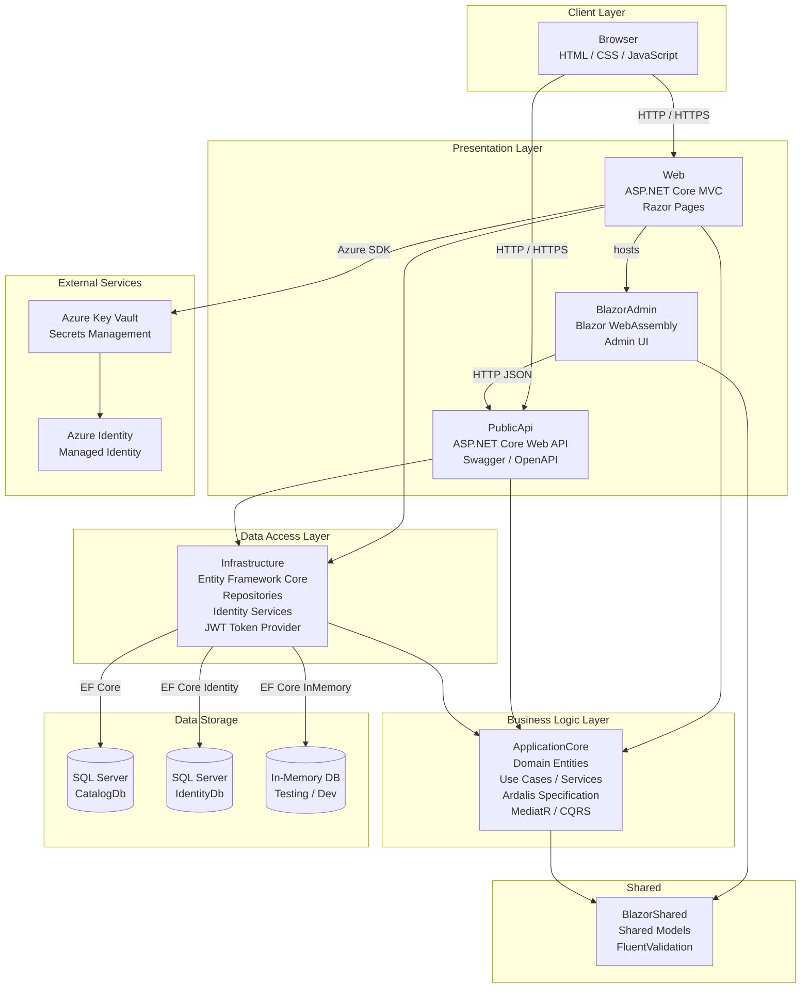

# Architecture Diagram

This diagram illustrates the high-level architecture of the eShopOnWeb application, a reference ASP.NET Core e-commerce solution with a layered structure.

## Application Architecture

