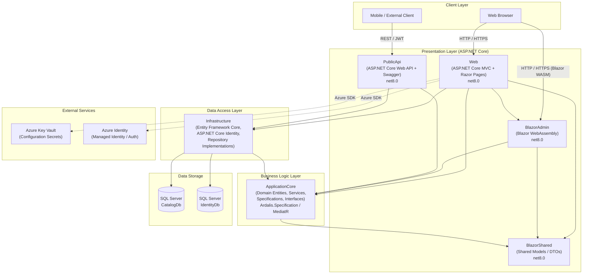

# eShopOnWeb Architecture Diagram

## Application Architecture

## Technology Stack Summary

| Layer | Project | Framework / Libraries |
|---|---|---|
| Web UI | Web | ASP.NET Core 8 MVC + Razor Pages, Blazor WebAssembly Host, EF Core, Identity, MediatR, AutoMapper, Azure.Identity |
| Admin UI | BlazorAdmin | Blazor WebAssembly 8, Blazored.LocalStorage, FluentValidation |
| Shared Models | BlazorShared | .NET 8 class library |
| REST API | PublicApi | ASP.NET Core 8 Web API, Minimal API Endpoints, Swagger/OpenAPI, JWT Bearer |
| Domain | ApplicationCore | .NET 8, Ardalis.Specification, Ardalis.GuardClauses, Ardalis.Result |
| Data Access | Infrastructure | EF Core 8, SQL Server, ASP.NET Core Identity |
| Data Storage | — | Microsoft SQL Server (Catalog DB, Identity DB) |
| Cloud Integration | — | Azure Key Vault, Azure Identity (Managed Identity) |
